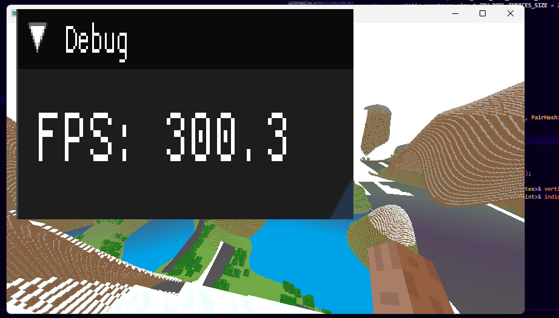
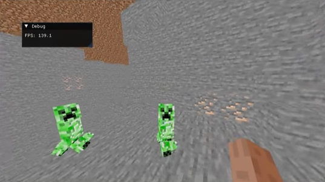
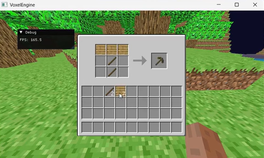

# cpp-zero-to-hero

A voxel game engine built from scratch in C++ and OpenGL. 14,000+ lines of code, no tutorials, no game engine frameworks — just raw OpenGL, a compiler, and stubbornness. Started with basic Java knowledge and taught myself C++ by building this.

A clean architectural rewrite is currently in progress: **[Call of a hero](https://github.com/Okaimono/call-of-a-hero)**

## Demo

- [**Video 1** — 7 Weeks of Learning C++/OpenGL Progress](https://www.youtube.com/watch?v=fH129ybGQDQ)
- [**Video 2** — Creeper AI & Movement](https://www.youtube.com/watch?v=EqHFVoe95TQ)
- [**Video 3** — 45 Chunk Render Distance at 300 FPS](https://www.youtube.com/watch?v=X2Rf_YjeDkg)

## Gallery

  
  

  
  

---

## Systems Breakdown

### GPU Memory Management — `ChunkRenderer.cpp`

The renderer pre-allocates a 4 GB vertex pool and 1 GB index pool on the GPU at startup, then manages chunk data through a slot-based system. Each chunk gets a fixed-size reservation (30K vertices, 40K indices), and uploads happen via `glBufferSubData` into the correct slot offset. Chunks are drawn with `glDrawElementsBaseVertex` so index data doesn't need rebasing on upload. A lookup map tracks which chunk coordinates own which slot, enabling O(1) re-uploads when chunks are modified and O(1) deletion when chunks unload. The entire world renders in a single VAO bind with per-chunk draw calls offset by world position uniforms.

### Multithreaded Chunk Pipeline — `JobQueue.cpp` / `World.cpp`

Chunk generation and meshing run on worker threads through a priority-ordered job queue. The system processes generational updates — each update contains a batch of chunks to generate and a batch of meshes to build. Generation jobs run first; mesh jobs are held until all their dependent chunks complete, tracked via an `uncompletedChunks` set. This prevents meshing a chunk before its neighbors exist (which would produce incorrect face culling at chunk borders). The queue uses condition variables for thread sleeping and mutex-guarded access. Completed meshes are pushed to a thread-safe queue and uploaded to the GPU on the main thread during the render loop.

### Terrain Generation — `WorldGeneration.cpp`

World generation uses layered FastNoiseLite passes to produce biome classification, forest density, height mapping, and ore distribution. Biome noise controls terrain shape — plains are flat (20-block amplitude), forests get rolling hills (50-block amplitude with vertical offset), and mountains spike to 200+ blocks. Transitions between biomes use linear interpolation over the noise gradient so there are no hard edges. Ore placement uses a separate 3D noise field with depth-dependent thresholds: diamond only below Y=16 at high noise values, coal abundant above Y=35, iron in the middle band. Trees generate via a dedicated noise layer combined with random thinning, with boundary checks to prevent leaf geometry from overflowing chunk edges.

### Mob AI & Pathfinding — `Creeper.cpp`

Creepers use A* pathfinding with an octile distance heuristic to navigate 3D voxel terrain toward the player. The pathfinder distinguishes three movement types per neighbor: walk (ground-level traversal), fall (1-block drops), and jump (1-block climbs), each with different costs. Diagonal jumps are rejected. The open list is a hand-written binary min-heap backed by a stack-allocated pointer array, and the closed list uses a spatial hash (prime-number XOR encoding of integer coordinates) in an `unordered_set<int64_t>`. Node allocation comes from a pre-sized pool of 10,000 `PathNode` structs that resets each pathfinding call — zero heap allocations during search. Path updates are throttled: the creeper only recalculates when the player moves 3+ blocks or 1 second has elapsed.

The creeper mesh is a single unified VAO with 6 body parts (head, torso, 4 legs) distinguished by a `partID` vertex attribute. All 6 transformation matrices are uploaded in one `glUniformMatrix4fv` call per frame. The head independently tracks the player using slerp-smoothed orientation, while the body rotates via `atan2`. Leg swing uses sinusoidal animation with precomputed walk matrices.

### First-Person Arm — `ArmHUD.cpp`

Hand-rolled inverse kinematics for a 3-joint arm chain (shoulder → elbow → wrist) computed in world space every frame. The arm constructs an orthonormal basis from camera orientation vectors, then positions the shoulder relative to the camera with fixed offsets in that basis. The elbow interpolates toward target positions with smooth damping, and walking adds sinusoidal swing driven by a continuously rotating angle. Swing animations override the elbow/wrist targets with rotation matrices applied over a 360° arc. Three completely separate render paths exist for empty hand (arm mesh with Steve skin UVs), held items (flat quad with item atlas UVs), and held blocks (full cube with block atlas UVs), each generating their own vertex data and applying different transformation pipelines.

### Block Interaction — `BlockInteraction.cpp`

Block mining uses a raycast from the player's position along their look direction, stepping in 0.1-unit increments up to the interaction range. Each block type has a base health value (dirt: 0.75s, stone: 7.5s, obsidian: 250s, bedrock: effectively infinite) that decreases per frame scaled by the held tool's speed multiplier — pickaxes boost stone-family blocks, axes boost wood, shovels boost dirt/sand. Tool durability decrements on each successful mine. Block-to-item conversion handles special cases: stone drops cobblestone, ores drop their respective materials, leaves have a 5% sapling drop chance, gravel has a 10% flint chance, lapis/redstone/glowstone drop multiple items with randomized quantities. When a block is mined, the system triggers mesh updates for the containing chunk and all adjacent chunks if the block was on a chunk border.

### Inventory & GUI — `GUIManager.cpp` / `InventoryUI.cpp` / `ChestUI.cpp`

The inventory system implements full left-click and right-click item manipulation matching Minecraft's behavior. Left-click picks up a full stack, places it, or swaps with existing items. Right-click splits stacks in half for pickup, places single items, or adds one to existing stacks of the same type. The GUI maps pixel-space click coordinates to inventory slot indices using the UI's known layout dimensions and slot spacing. Item decals render as textured quads positioned over each occupied slot using UV lookups from an item atlas, with quantity text rendered via ImGui's foreground draw list. Multiple GUI states (HUD, inventory, crafting table, chest, furnace) are managed through a state machine with per-state render and click handling paths.

### Physics & Input — `PhysicsEngine.cpp` / `PlayerController.cpp`

Physics engines use a static registry pattern — each entity's physics component registers itself on construction, and a single `updateWorldPhysics()` call ticks all registered engines at a fixed timestep with gravity and axis-aligned block collision. Input flows through a clean abstraction chain: `GLFW → InputManager` (raw key/mouse state with press-vs-hold detection) `→ PlayerInput` (semantic action polling) `→ PlayerController` (game logic application), keeping raw input handling f

## Tech

C++17, OpenGL 3.3, GLFW, GLAD, GLM, ImGui, stb_image, FastNoiseLite
